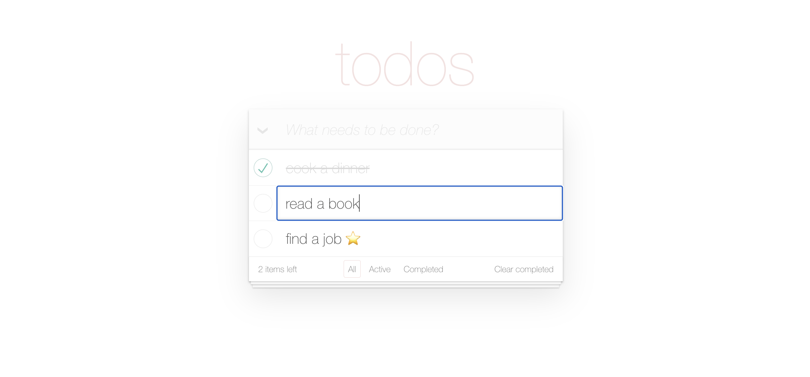

# 📝 Todo App

A modern Todo application built with **React** and **TypeScript** that helps users manage daily tasks. The application supports creating, editing, completing, filtering, and deleting todos with smooth UI interactions and REST API integration.



## 🔗 Live Demo

👉 **Demo:** https://dazavrrr.github.io/todo-app/

## 💻 Source Code

👉 https://github.com/Dazavrrr/todo-app

---

## ✨ Features

- Create new todos
- Edit existing todos
- Delete single todos
- Clear completed todos
- Toggle todo completion
- Toggle all todos at once
- Filter by **All / Active / Completed**
- Loading indicators during API requests
- Optimistic UI updates
- Error handling and notifications
- Responsive interface

---

## 🛠 Tech Stack

- React 18
- TypeScript
- React Router
- SCSS
- Bulma
- Font Awesome
- REST API

---

## 🚀 Getting Started

Clone the repository:

```bash
git clone https://github.com/Dazavrrr/todo-app.git
```

Install dependencies:

```bash
npm install
```

Run the project locally:

```bash
npm start
```

Create a production build:

```bash
npm run build
```

Deploy to GitHub Pages:

```bash
npm run deploy
```

---

## 📂 Project Structure

```text
src/
 ├── api/
 ├── components/
 ├── hooks/
 ├── styles/
 ├── types/
 ├── utils/
 ├── App.tsx
 └── index.tsx
```

---

## 📸 Preview


---

## 👤 Author

**Daria Melnyk**

- GitHub: https://github.com/Dazavrrr
- LinkedIn: https://www.linkedin.com/in/dazavrrr
